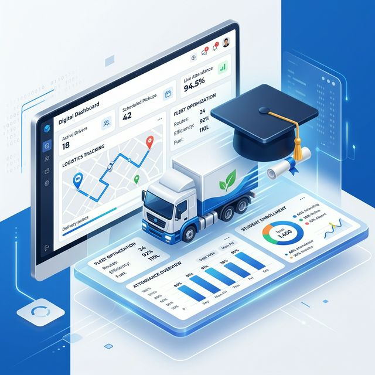

# 🎓 DigyNex TMS: Transport & Education Intelligence
## Specialized Management System for Growth-Focused Hubs

### 1. System Identity
**DigyNex TMS** is a dual-purpose management system optimized for **Transport Logistics** and **Education Centers (Tuition Hubs)**. It bridges the gap between physical attendance/movements and digital financial records.

---

### 2. Core Functions
*   **Attendance Tracking:** Real-time recording of "Punctuality & Presence" via high-speed scanning or manual check-ins.
*   **Dynamic Fee Management:** Automated tracking of monthly dues, discount logic, and outstanding balance alerts.
*   **Parent/Client Communication:** Instant automated messaging (WhatsApp/SMS) triggered by attendance or payment events.
*   **Achievement Marketing:** "Star of the Month" engine for automated social media promotion of top performers.
*   **Financial Payouts:** Automated tutor/subcontractor payment calculations based on performance KPIs and attendance density.

---

### 3. Technical Specifications
*   **Frontend Ecosystem:** Lightweight, mobile-first responsive design for staff on-the-ground.
*   **Alert Integration:** Webhook-based connectivity to n8n for high-speed WhatsApp delivery.
*   **Data Structure:** Optimized PostgreSQL schema for recursive relationship management between Students/Drivers, Classes/Routes, and Payments.
*   **Reporting:** Real-time "Operations Dashboard" showing daily density and gross collection metrics.

---

### 4. Business Benefits
*   **Reduced Administrative Overload:** Automates 90% of routine notifications and manual attendance logging.
*   **Improved Cash Flow:** Automated reminders for outstanding fees reduce late payments by an average of 30%.
*   **Brand Authority:** Professional, automated billing and communication improve trust with parents and B2B clients.
*   **Actionable Data:** Insights into "Peak Enrollment/Usage" help management optimize resource allocation and scheduling.

---

### 5. Future Roadmap
*   **Live GPS Tracking Overlay:** Visualizing transport routes in real-time on the TMS dashboard.
*   **Parent Portal 2.0:** Secure login for parents to view digital receipts and student progress reports.
*   **AI Behavioral Insights:** Predictive analysis to identify students or routes at risk of drop-out or inefficiency.

---
*© 2026 DigyNex Ecosystem | Operational Systems Hub*
