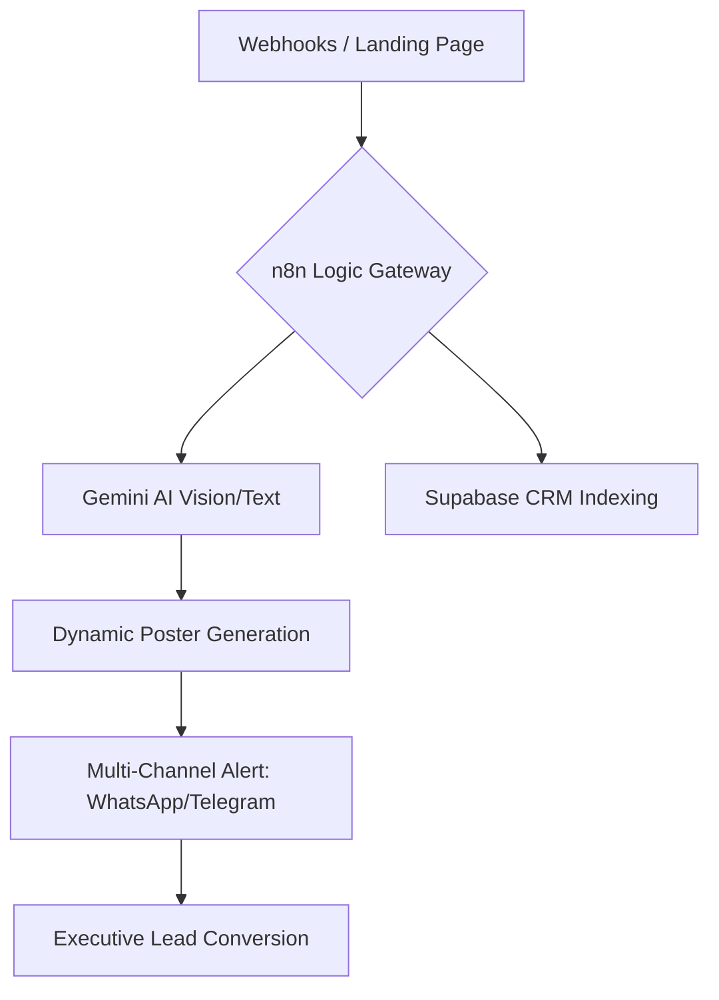

# 👑 THE DIGYNEX 360 MASTER MANIFEST v2.0
## "Operational Sovereignty & Strategic Intelligence"

---

### 🏛️ EXECUTIVE SUMMARY
DigyNex is a next-generation Enterprise Operating System designed to achieve **Operational Sovereignty** through AI-augmented intelligence. This manifest unifies our entire ecosystem of tools, from financial governance to autonomous AI marketing.

---

### 📂 MODULE 01: DigyNex 360 Enterprise BOS
**Role:** Strategic Core & Executive Decision Intelligence

*   **BI Drill-down Modal:** Real-time visibility into "Revenue vs. Net Profit" with interactive ApexCharts.
*   **Active Operations:** Automated conversion of Purchase Orders (PO) to Invoices with 0% data leakage.
*   **Universal Labeling (ULS):** Instant Industry Vertical adaptation (Project, SaaS, Education modes).
*   **RBAC Security:** Zero-Trust architecture ensuring organizational data isolation.

> [!TIP]
> **Business Value:** Gain 100% financial transparency and reduce administrative decision cycles by up to 75%.

---

### 🤖 MODULE 02: AI Social Nexus (The Core Request)
**Role:** Automation Hub & Neural Engine (n8n + Gemini + FB API)

#### **1. Core Automation Architecture**

#### **2. Technical Specifications**
*   **Sweden Timezone Sync:** All reporting and social posting scheduled via **Europe/Stockholm (CET)** logic.
*   **Node Optimization:** Custom JavaScript mapping nodes for precise JSON schema validation.
*   **Autonomous Monitoring:** 24/7 "Heartbeat" monitor tracking throughput and API latency.

---

### 🎓 MODULE 03: DigyNex TMS (Transport & Edu)
**Role:** Operational Logistic Hub

*   **Attendance Alerts:** Direct parent/client WhatsApp notifications on arrival.
*   **Star Poster Gen:** Automatic congratulatory banners for top performers.
*   **Fee Ledger:** Real-time balance tracking with automated late-payment reminders.

---

### 🔮 FUTURE SECTOR EXTENSIONS (Selling Potential)
We are ready to deploy the DigyNex engine into the world's most profitable B2B sectors:

| Sector | High-Value Feature | Monetization Potential |
| :--- | :--- | :--- |
| **🚚 Logistics** | AI Proof-of-Delivery (POD) scanning | $1B+ Target Market |
| **🌾 Agri-Tech** | Crop Health Analysis via Gemini Vision | Global Export Scaling |
| **🏗️ Construction** | Milestone Validation & Ledger Sync | Government/City-Scale Data |

---

### 🛡️ CONCLUSION
This report serves as the **Standard of Excellence** for DigyNex implementations. We are not just building software; we are building the future of enterprise decision-making.

---
*© 2026 DigyNex Ecosystem | Confidential Master Manifest*
